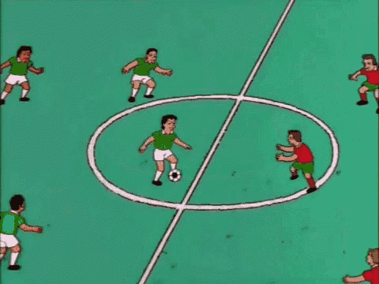
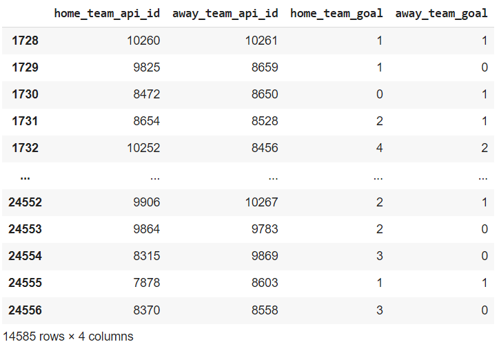
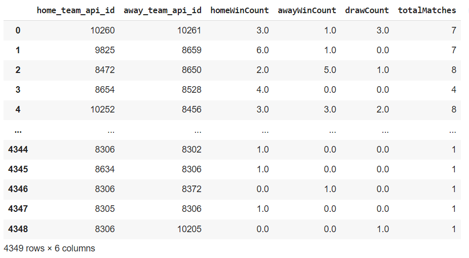
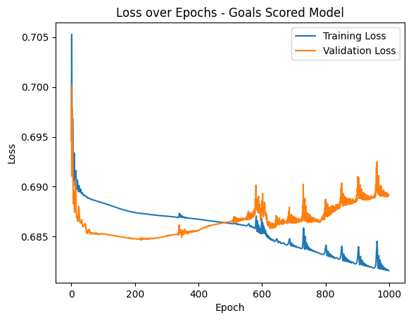
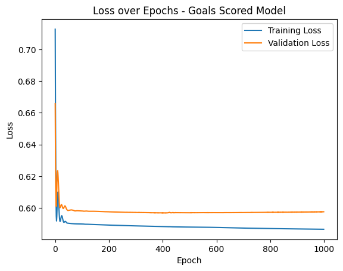

# Soccer Match Predictor - Introduction Rough Draft

<!--  -->
<p align="center">
  
</p>

### Team members: Anna, Elshiekh, Alan, Yotam

## Introduction

If you follow soccer or any sport for that matter, religiously, you’ll quickly realize that the outcomes are usually unpredicable. Furthermore, accurately predicting the outcome of soccer matches is difficult. Last year, 1.5 billion people watched the world cup, making soccer the most popular sport in the world. Fans around the world try to predict the outcome of soccer matches for fun or even to make money through sports betting. The unpredictability of soccer matches presents a fun opportunity to use machine learning to create a model that can accurately predict that outcome of soccer matches. Using the model can also lead to sports betters making more informed decisions (Tjioe et al. 2020).

You can always have a good idea of who might win based on team strength, but even that cannot be trusted at times due to the many other factors that come into play: inconsistency of players, unpredictable events during and surrounding a match, the dynamic nature of team performance and luck. Traditional statistical models, such as ELO rating systems and various regression models, often fail to incorporate these factors (B. G. Aslan and M. M. Inceoglu 2007). Ultimately, this leads to statistical models producing inaccurate results. In addition, these models often use data from past performances without considering current conditions. For example, Fernando Torres had impressive stats during his time in Liverpool, but when he moved to Chelsea his stats were lackluster. Machine learning has the potential to build relationships across many factors and potentially improve some of these difficulties, which has the potential to improve the accuracy of preductions. That's not to say models shouldn't rely on past performances. A Reccurrent NN with LSTM cell modifications used data from 2010-2018 to achieve a prediction accuracy of 80.75% (Tiwari et al. 2020). This accuracy is greater than predictions made with NN, and is in-line with models that employ more advanced techniques.

Prior work in this area have used NN with features such as whether a team is home or away and ELO rankings, however the model's accuracy tends to be ~50% (Ulmer and Fernandez 2014). Adding more features, such as considering the team's lineups and penalties, as well as switching to a deep learning architecture resulted in an prediction accuracy of 63.3% (Rahman 2020). Both of these work classify a match ending as a win, draw, or loss, but the work done by Rahman adds a "small margin where it is safer to predict a draw then win", which when combined with a more advanced architecture, leads to a more accurate model (2020). 

Using a neural network, NN,  we will use various factors such as player statistics, team dynamics, and performance in previous matches for our prediction. The integration of diverse data sources and the use of advanced machine learning algorithms will help overcome the limitations of prior work. The prediction accuracy can be increased significantly compared to prior work through more advanced techniques. Supervised learning and a radial basis function predicted a win rate of 83.3% and a loss rate 72.7% for the 2018 World Cup matches (Hassan et al. 2020). Addionally, more advanced team stats like total team medium pass attempted helped improve the accuracy. One can achieve a similar accuracy by using the black-box method with a NN (Aslan and Inceoglu 2007).  

The dataset used contains information about European soccer teams from 2008 to 2016. The [Kaggle](https://www.kaggle.com/datasets/hugomathien/soccer) dataset contains information from 25,000+ matches and is a very popular dataset for soccer information.

In our results, we expect to see significant improvement in prediction accuracy compared to traditional statistical models and human intuition. We test our results by comparing our model’s predictions against actual match outcomes and against other prediction systems. In our future work, we would like to make regular updates to our model to keep it current with new information and features as well as potential advancements in machine learning techniques. 

## Methods
We obtained the dataset from kaggle and need to make sure it looks clean and take care of some preprocessing logistics. Of the 25,000 data points collected from different leagues, we used matches from countries in the top 5 leagues: England, France, Germany, Italy, and Spain. 

We also removed data that was formatted in XML and the predicted odds from various betting companies. Our dataset then contains the ids for the country, home and away team, and a column of 0s and 1s where 1s represent a home team win. We created 2 different dataframes, a simple model which only contains the home and away teams ID numbers, and the amount of goals scored by each team. 
<!--  -->
<p align="center">
  
</p>
<p align="center">
  <em>Figure 1: Goals Scored Model Table</em>
</p>

The complex dataframe also contains the ID numbers, with the addion of each team's head-to-head history. The head-to-head history contains the total amount of times each team has played eachother, as well as the number of times the home and away team has won. Also included is the number of times the match has ended in a draw.
<!--  -->
<p align="center">
  
</p>
<p align="center">
  <em>Figure 2: Goals Scored Model Table</em>
</p>

We are using pyTorch’s Neural Network [library](https://pytorch.org/docs/stable/nn.html), from which we will be using the feed forward architecture. We will be creating two different models and comparing the accuracy of using different features. The models we created are labeled Goals Scored and Head-To-Head. The Goals Scored model is a feed forward model with 3 layers. The input layer has 2 input nodes and 16 nodes in the first hidden layer, 32 nodes in the 2nd hidden layer, and 1 output node.The Head-To-Head model is also a feedvforward model with 3 layers. The layers are identical, except the input layer has 4 input nodes. 

After the dataframes were completed, we normalized the data using a label encoder, and then split the data into a training and test set. Both of the sets are of size 14585 elements 
```
label = LabelEncoder()
#Fit label and return encoded labels for training data
matches["home_team_api_id"] = label.fit_transform(matches["home_team_api_id"])
#Transform to normalize for test data
matches["away_team_api_id"] = label.transform(matches["away_team_api_id"])
#Training
X = matches[["home_team_api_id", "away_team_api_id"]].values
#Test
y = (matches["home_team_goal"] > matches["away_team_goal"]).values
X_train, X_test, y_train, y_test = train_test_split(X, y, test_size=0.2, random_state=47)
```
For the 2-Feature model, the training set was made up of the home and away team's ID numbers, and the output is a vector of 0s and 1s, where a 1 represents a home team win. For the 4-Feature model, the training set included the draw count and number of total matches played, in additional to both team's ID number. The output is idential, except a 1 represents that the home team has more head-to-head wins than the away team.

For our model, we are hoping to train the neural network to accurately predict whether Team A or Team B will win, or if the result will be a tie. A tie will be declared if the model predicts the team will tie within the range 45-55%. We believe its best to add this margin because approximately 25% of soccer matches end in a draw, and the probability that the model will give a prediction of exactly 50% is rare.

With the 2-Feature model, we will also analyze changes in the prediction accuracy by changing hyperparameters. The base model uses a binary cross entropy loss function, the Adam optimizer, and is trained with 100 epochs. We will be changing each of these parameters, as well as adding dropout layers, making the model deeper and/or wider.

The end result we are hoping for is a model that when asked for the outcome of a soccer match would seem like a very well informed sports analyst, as opposed to a "dumb" model that simply picks a team at random. Such a model would most likely predict soccer matches correctly 33% of the time. 

Possible pitfalls we see in our model is low or inaccurate classification. In our code, the home team wins if they score more points than the away team, but the model does not account for ties. At this moment, we simply treat a tie as a home team loss. However, of the 14,000+ matches in the 2-Feature dataframe, ~4000 of them end in a draw. We predict that this will lead to the model having lower accuracy than expected.


## Discussion
We used the European Soccer Database and filtered out the teams that did not belong to England, France, Italy, Spain, or Germany. We created 2 models, a NN that only considers the goals scored by both teams and another model that considers a team's head-to-head history. It should be noted that there are stats that cannot be measured, such as player morale, that plays a large role in determining how a player does in a given match (Shum 2020). Our comparison will focus on the accuracy of the two models we created, as well as models featured in the Introduction. Running the simple model produces an accuracy of ~55%. This is not the result we expected as if you tell a person the goals scored by each team in a match, they can tell you who won with 100% accuracy. We believe this is a result of the following line:
```
y = (matches["home_team_goal"] > matches["away_team_goal"]).values
```
As mentioned previously, a 0 represents a home loss and a 1 represents a home win, and this line treats draws as a loss. However, ~30% of the matches in our data frame end a draw, which likely explains the low accuracy of our model. Compared to our related works our results were significantly worse. We yielded an accuracy of below 60% for our validation dataset while many optimized models in the field can consistently predict with above 70% accuracy. Looking at Fig. 1, 
<!--  -->
<p align="center">
  
</p>
<p align="center">
  <em>Figure 3: Goals Scored Loss Graph</em>
</p>
one can see that validation loss is lower than training loss, which looks like our model performs slighly better on data it has not seen before. However, the y-axis scale is a bit misleading, and these two graphs are nearly on top of each other. Rerunning the model for 1000 epochs generates the following graph, 

<!--  -->
<p align="center">
  
</p>
<p align="center">
  <em>Figure 4: Goals Scored Loss Graph - 1000 Epochs</em>
</p>
one can see that the model is learning until around epoch 380 when the model starts overfitting. Initially, it looked like validation loss started to stabilize around epoch 200, but ultimately started overfitting. We predict early stopping may help remedy this problem.

Another step we tried to increase the accuracy was making the model wider and deeper. We first tried making the model deeper by adding an additional 2 layers, however the increase in accuracy was marginal. Then we tried making the model wider by doubling the number of nodes in each layer, however that also only marginally increased the accuracy. Next we tried making the model wider and deeper which increased our accuracy from 55% to 56%, the highest we've achieved so far. Running the model for 1000 epochs shows that the model beings to overfit around epoch 250, as shown in Fig. 5. Finally, the last remedy we tried was adding dropout layers. We added dropout layers with a probability of 0.2 to the first 2 layers, but our accuracy ended up decreasing slightly. The accuracy was still 55%, however all other remedies have managed to hover above 55.5%, but adding dropout layers decreased the accuracy to 55.1%.

<!--  -->
<p align="center">
  
</p>
<p align="center">
  <em>Figure 5: Goals Scored Loss Graph - More layers and Double the Number of Nodes</em>
</p>

As mentioned previously, our model treats a draw as a home loss. Having the model treat a draw as a home win instead significantly improves the accuracy. This time, we achieved an accuracy of 71.13%, which is on par with some of the models discussed earlier, however given that the model takes in goals scorred, it is still below what we hoped for. The change in accuracy is most likely due to class imbalance. By treating draws as a home win, we are increasing the number of positive class examples, which allows the model to learn more patterns when a match ends in a draw. Compared to figure 3, the loss graph with this condition is much more stable when run with a larger amount of epochs. The same hyperparameters were changed as in the first scenario, however none of the changes increased accuracy beyond 71%.

<!--  -->
<p align="center">
  
</p>
<p align="center">
  <em>Figure 6: Goals Scored Loss Graph - Treat Draws as Home Win</em>
</p>


The 4-Feature model yielded slightly better results than the 2-Feature model, with an accuracy of 59%. Fig. 7 shows the loss over epoch graph. 
<!--  -->
<p align="center">
  
</p>
<p align="center">
  <em>Figure 7: Head-To-Head Loss Graph</em>
</p>
This time, our model worked better on data it has seen before. The graph shows that the model is still learning so we ran it for 1000 epochs instead of 100. The model accuracy increased by 2% and the loss graph also slightly improved. However, at around epoch 300, the validation loss curve begins to overfit. We ran a similar test to the 2-Feature model where we treat draws in head-to-head scores as a home win. The model accuracy increased to 68%, and we suspect the reasoning for the increase is the same as the 2-Feature model, i.e increasing the representation of the positive class. We are intending on using a multi-classification model architecture and building different combinations of features for further experiments. A function was also created that takes as input the ID number for two teams, and using the 4-Feature model, predicts the winner.

## Ethics
Predicting sporting outcomes does not cause any harm. People attempt to predict the outcome of sports matches all the time. Predicting the outcome of a match 

However, harm may occur when individuals use this model to gamble on sports betting websites. The European Soccer Database contains columns that list the betting odds  from a variety of sports betting websites. While listing the betting odds may be useful to gain insight on the prediction made by the company, we want to avoid incentivizing the urge to gamble.The one thing we want to avoid is a user using our model to gamble on soccer matches, and potentially losing money. Cumpulsive Gambling is a serious problem that has real word affects on an individual and their family. 

## Reflection
We would’ve liked to use a dataset that is more recent than what we used as our dataset only spans 2008 to 2016. Soccer teams can significantly evolve year-to-year, so our model likely wouldn’t be very useful for predicting current or future matches. We also would have used a dataset with more information – perhaps one that also contains individual player information. Using this, we could track which teams players are on and use their information to help predict how good a team might be. 

If presented with more time, we would’ve like to add a feature where instead of just picking the winning team, it could also predict the score line. Furthermore, it could predict who was likely to score based on individual players’ previous performances and their current up to date form. 

We would of also like to have a dynamically updating dataset that instead of using data from a fixed number of years (e.g. 2012-2018), it would instead take the data from the previous 5 years of the current year (e.g. if its 2023, the data used will be from 2017-2022). 

Additionally we believe that more features would allow us to achieve a higher accuracy. We are curious to do an analysis on the relevance of different features for the project to inform us as a heuristic for predicting matches, and just to obtain larger insights about the sport in general.

Our data focused more so on league games, which are a bit more predictable due to teams having a lot of head to head matchups against each other. We want to continue this work by expanding the scope of possible games through including more European based games (teams from different countries such as Real Madrid vs. Chelsea)  such as from the Champions League, Europa League, etc. 


## Works Cited
B. G. Aslan and M. M. Inceoglu, "A Comparative Study on Neural Network Based Soccer Result Prediction," Seventh International Conference on Intelligent Systems Design and Applications (ISDA 2007), Rio de Janeiro, Brazil, 2007.

E. Tiwari, P. Sardar and S. Jain, "Football Match Result Prediction Using Neural Networks and Deep Learning," 2020 8th International Conference on Reliability, Infocom Technologies and Optimization (Trends and Future Directions) (ICRITO). 2020.

Hassan A, Akl A-R, Hassan I, Sunderland C. Predicting Wins, Losses and Attributes’ Sensitivities in the Soccer World Cup 2018 Using Neural Network Analysis. Sensors. 2020.

Rahman, M.A. A deep learning framework for football match prediction. (2020)

Shum, Roland. "Neural Networks Football Result Prediction" 2020.

Ulmer, Benjamin and M. Pasadas Fernández. “Predicting Soccer Match Results in the English Premier League.” 2014.
